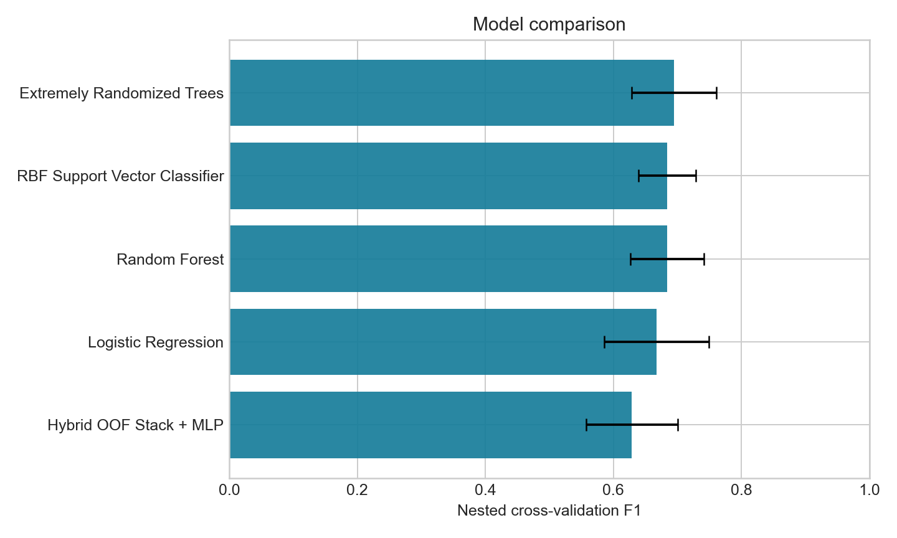

# Adult ASD Screening — Classical Machine Learning

[](https://github.com/aswanth-07/autism-prediction/actions/workflows/ci.yml)
[](https://www.python.org/)
[](https://scikit-learn.org/)

A reproducible tabular classification study built to demonstrate the full traditional machine-learning
workflow: data-quality auditing, leakage prevention, baselines, nested model selection, imbalance-aware
evaluation, threshold tuning, model interpretation, artifact versioning, tests, and deployment-safe
inference.

> **Educational research only.** This repository does not provide a diagnosis, clinical risk score,
> or medical device. Its supplied dataset is small and has incomplete provenance.

## Release result

The release protocol reserves a stratified 20% holdout before any model selection. Five classical
model families are tuned and compared using nested stratified cross-validation on the remaining data.
The decision threshold is learned from out-of-fold training probabilities, then the holdout is evaluated
once.

| Result | Value |
|---|---:|
| Selected model | Extremely Randomized Trees |
| Nested CV F1 | **0.695 ± 0.066** |
| Holdout F1 | **0.679** (95% bootstrap CI 0.511–0.816) |
| Holdout recall | **0.720** |
| Holdout precision | **0.643** |
| Holdout ROC-AUC | **0.924** (95% bootstrap CI 0.866–0.969) |
| Holdout average precision | **0.791** |
| Holdout balanced accuracy | **0.805** |

The interval is as important as the point estimate: the untouched holdout contains 116 adults and only
25 positive labels. Exact values, confusion matrix, parameters, versions, and the raw-data SHA-256 are
stored in [`reports/metrics.json`](reports/metrics.json).

## What makes the evaluation trustworthy

- **Adult-only contract:** the source labels every row “18 and more” but contains 223 ages below 18;
  those inconsistent rows are excluded and counted.
- **Untouched holdout:** model family, hyperparameters, and threshold are selected without using holdout
  outcomes.
- **Nested cross-validation:** five outer folds estimate model-family performance; four inner folds tune
  hyperparameters.
- **Fold-local preprocessing:** missing-value imputation, scaling, and one-hot encoding are fitted inside
  each training fold.
- **Deployable features only:** the undocumented continuous `result` field is excluded because the old
  app incorrectly replaced it with an AQ sum from a different distribution.
- **No target encoding:** unknown and rare categories are handled by an inference-safe one-hot encoder,
  eliminating the full-dataset target leakage in the legacy workflow.
- **Multiple metrics:** F1 is primary, with recall, precision, balanced accuracy, ROC-AUC, average
  precision, Brier score, confusion matrix, and bootstrap intervals reported together.

Read the complete forensic review in [`docs/REPOSITORY_AUDIT.md`](docs/REPOSITORY_AUDIT.md).

## Model comparison

| Model family | Nested F1 | Nested ROC-AUC |
|---|---:|---:|
| Extremely Randomized Trees | **0.695 ± 0.066** | 0.895 |
| RBF Support Vector Classifier | 0.684 ± 0.044 | 0.885 |
| Random Forest | 0.684 ± 0.058 | **0.899** |
| Logistic Regression | 0.668 ± 0.082 | 0.892 |
| Hybrid OOF Stack + MLP | 0.629 ± 0.072 | 0.859 |

Model complexity is not treated as a result. Logistic Regression remains an explicit baseline, while
SVC and two bagging ensembles test nonlinear decision boundaries. The custom hybrid combines genuine
out-of-fold Random Forest, linear SVC, and AdaBoost probabilities with selected source features before
an MLP meta-learner. The winner is selected by outer-fold F1, not by novelty or holdout score.



## Repository map

```text
.
├── App/app.py                    # Ethical Streamlit inference demo
├── Data/Raw Data/Raw Data.csv    # Preserved supplied dataset
├── Models/
│   └── production_pipeline.joblib# Pipeline + threshold + metadata
├── reports/
│   ├── figures/                  # Generated evaluation plots
│   ├── metrics.json              # Machine-readable release evidence
│   ├── model_comparison.csv
│   └── permutation_importance.csv
├── src/asd_screening/
│   ├── data.py                   # Schema, audit, normalization
│   ├── modeling.py               # Preprocessing and model families
│   ├── evaluation.py             # Metrics, threshold, intervals
│   ├── training.py               # End-to-end release protocol
│   ├── inference.py              # Artifact validation and prediction
│   └── web_export.py             # Exact Extra Trees browser export
├── exports/                      # Versioned static web model
├── tests/                        # Data, pipeline, artifact, web parity tests
├── DATA_CARD.md                  # Provenance and representation limits
├── MODEL_CARD.md                 # Intended use and evaluation contract
└── *.ipynb                       # Preserved historical experiments
```

## Reproduce the release

Python 3.10–3.13 is supported.

```bash
git clone https://github.com/aswanth-07/autism-prediction.git
cd autism-prediction
python -m venv .venv
```

Activate the environment, then install and train:

```bash
python -m pip install --upgrade pip
python -m pip install -e ".[dev]"
python -m asd_screening.training
```

The command regenerates the production artifact and every file in `reports/`. A fast structural smoke
run is available as `python -m asd_screening.training --quick`; its metrics must not be published.

## Run the inference demo

```bash
streamlit run App/app.py
```

The app reads its model name, version, feature contract, category options, and threshold from the
artifact. It does not hard-code training statistics, store responses, or present the score as a clinical
probability. Because authoritative questionnaire wording is absent from the supplied data, it accepts
the ten already-scored binary source fields instead of inventing a questionnaire.

## Export exact browser inference

```bash
python -m asd_screening.web_export
```

This writes `exports/asd_extra_trees_web.json`: numeric scaling state, categorical vectors, threshold,
metadata, and all 300 fitted trees. The reference evaluator is tested against scikit-learn on reviewed
records with maximum absolute probability error below `1e-12`. A static frontend such as Vercel can
therefore run the selected release model without Python, an API, or transmitting a user's inputs.

## Quality checks

```bash
ruff check .
mypy src
pytest
```

GitHub Actions runs the same checks on pushes and pull requests. Tests cover the reviewed row counts,
age scope, schema failures, missing and unseen categories, threshold metrics, artifact compatibility,
end-to-end inference, and parity between scikit-learn and the exported browser model.

## Historical notebooks

The seven root notebooks are retained as coursework history and cover preprocessing, base models,
ensembles, stacking, a hybrid ensemble, tuning, and visualization. They are **not** the release benchmark:
several use derived CSVs encoded before splitting or select a winner by test F1. Install their optional
environment with:

```bash
python -m pip install -e ".[legacy]"
```

Their exact disposition is recorded in the repository audit. The production source and reports are the
single source of truth for current claims.

## Responsible limitations

- Dataset origin, collection protocol, consent basis, and dataset-specific license are not bundled.
- The dataset is small, imbalanced, demographically uneven, and contains many unknown categories.
- The available gender values are only `f` and `m`; subgroup fairness is not established.
- Performance has not been externally validated on a separate population.
- A model score cannot confirm or rule out ASD and must not guide care.

See [`DATA_CARD.md`](DATA_CARD.md) and [`MODEL_CARD.md`](MODEL_CARD.md) before interpreting any output.

## License

Code is provided under the repository's [MIT License](LICENSE). The dataset's own licensing and
provenance remain unresolved; the code license does not grant rights to redistribute the data.
